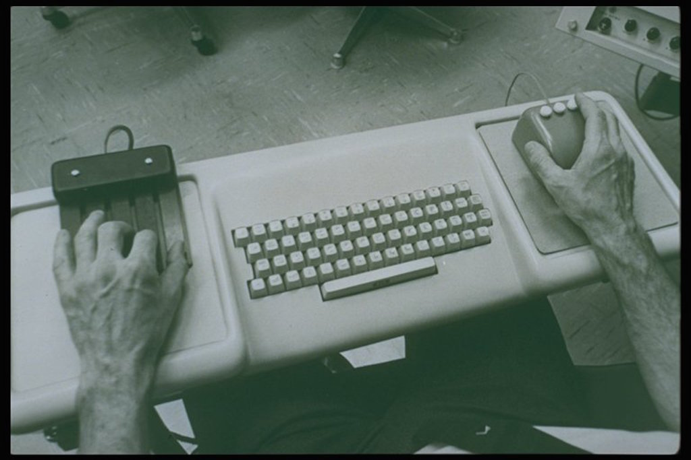

# Augmentation not automation 

A pioneer in human-machine interfaces and a solver of unusual problems, Doug Engelbart - inventor of the computer mouse, among other things - had a mantra: _augmentation not automation_. 

Engelbart's work focused on the human intellect and how to improve it. Yet, his [framework conceptual for augmenting the human intellect](http://www.dougengelbart.org/pubs/augment-3906.html) can guide our exploration of the connected home, too. 

He aimed to increase a human's capability to approach a complex problem situation, meaning "more-rapid comprehension, better comprehension, the possibility of gaining a useful degree of comprehension in a situation that previously was too complex, **speedier solutions, better solutions, and the possibility of finding solutions to problems that before seemed insoluble.**" (emphasis ours)

Let's veer away from the human intellect and focus on the role of technology in general, and in the connected home in particular. Technology - and the various pieces of tech in the connected home - should aim to augment us as well, to help us be more human, more ourselves. It should offer us speedier, better solutions, and solve problems that previously seems insoluble.

## Automation is a natural first step

The connected home products we see on the market today (or judging by conversations with many manufacturers and designers working in the field, on the way to market) focus to a large degree on home automation. There's nothing wrong with it, it's a natural first step. It's (comparatively) simple and offers a clear value (if done right), so it's (again, comparatively) low-hanging fruit.

Inarguably, there's a lot to be gained for users from home automation. Nobody would argue with the convenience and time savings of a laundry machine, a dishwasher or a vacuum cleaner. 

The same will hold true for many connected home appliances. The true automation magic might, however, not happen at the device level. Everyone who ever had to install one smartphone app per connected home device - thermostat, lightbulb, smart lock - will agree, the trick might turn out to be smart integration at the software layer: One app to rule them all. 

Maybe more importantly, automation does not require a lot of explanation: _I used to regulate my heater by hand, now it self-regulates._ Simple to understand, no explanation needed.

## Explaining a new home

Which brings us back to Doug Engelbart. One of his most famous moments is the first demo of the mouse: A groundbreaking, absolutely novel human-computer interface. ([The origin story of the mouse](http://www.dougengelbart.org/firsts/mouse.html) makes for a great read.) 

That demo went down in the history books (in the interaction design history books at least) as [The Mother of All Demos (video playlist)](https://www.youtube.com/playlist?list=PL76DBC8D6718B8FD3&feature=plcp).

_Human-computer interface with mouse. Photo: Doug Engelbart Institute_

If you watch Engelbart's demo (which you should, it's both brilliant and entertaining), you will note that he has to start pretty much with first principles:

**When introducing the mouse, Engelbart doesn't just introduce a new computer peripheral. He also introduces a new paradigm of human-machine interaction.**

That means he doesn't just need to explain how the mouse works, but also needs to elaborate on...

- what it is
- what it is for (which problems it helps solve)
- how it makes its users' lives better (why is it worth engaging with)

There's a long passage in which Engelbart riffs on typing up a shopping list and sorting it, clustering items by category and shopping aisle, thanks to copy & paste as well as his handy new pointing device, the mouse. That's a lot of explaining for just one small device. Smart home device manufacturers beware!

**Introducing connectivity into our homes requires a lot of explanation:** What is being introduced, why is it worth it, what does it help us do better? What are the implications, use cases, and limits? **Why might it be worth fundamentally changing your notion of your own home for this new thing?**

This is a communications challenge on one hand. But more importantly it's a litmus test that designers and developers can apply to new ideas: Can the thing you are considering pass this filter? Will it be worth radically redefining what we mean traditionally mean by "home"?

## Key takeaways

- Automation is just a first step.
- The key is augmenting users to solve problems more easily, to give them super powers.
- Introducing connectivity into a safe place like the home requires a clear value proposition and very good explanation.

_Thanks to [Scott Jensen](http://www.jenson.org/) for the pointer to Engelbart's work for this context._

